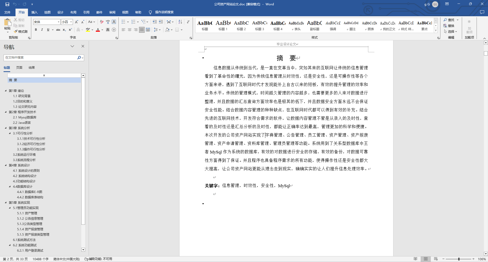
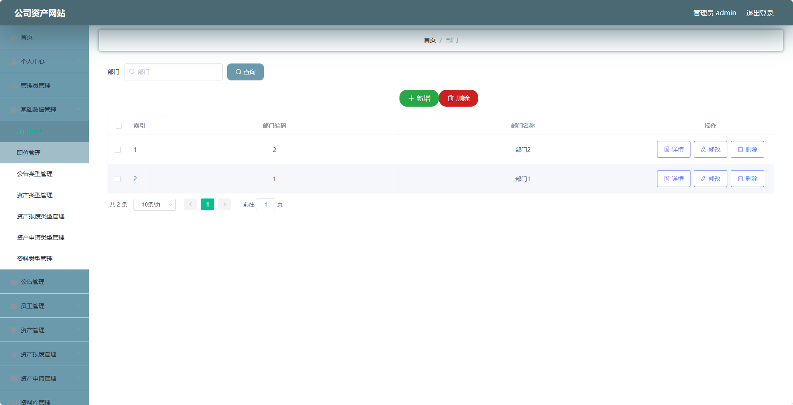
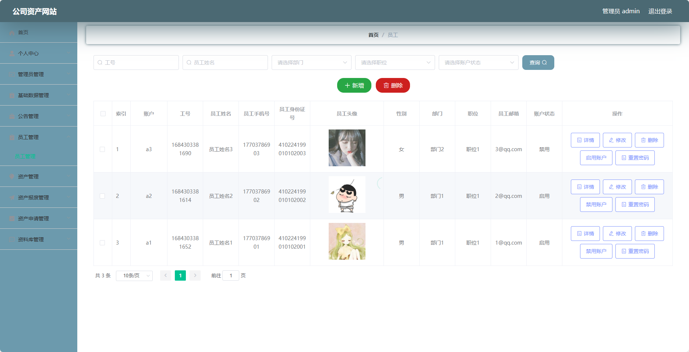
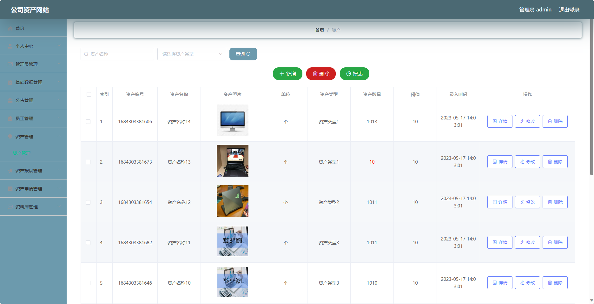
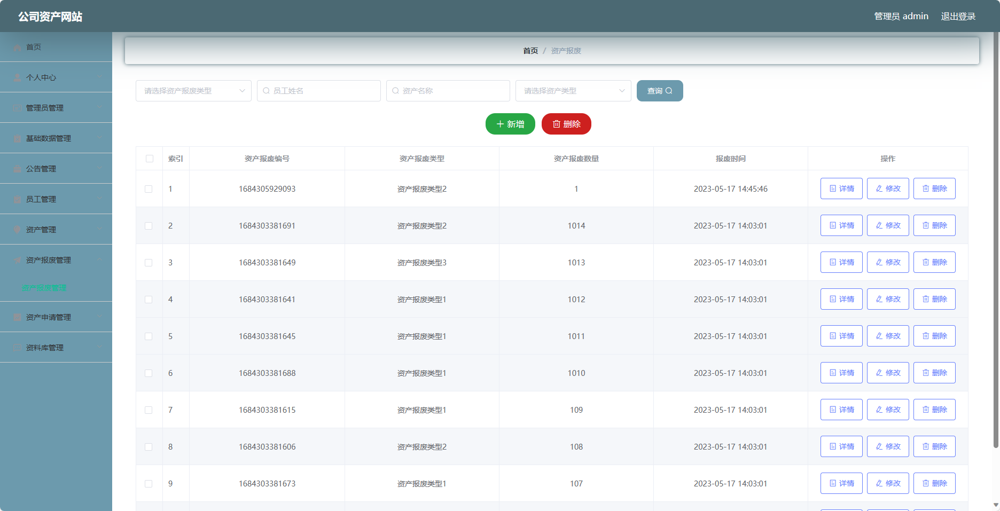
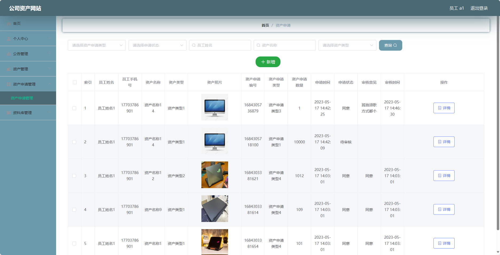
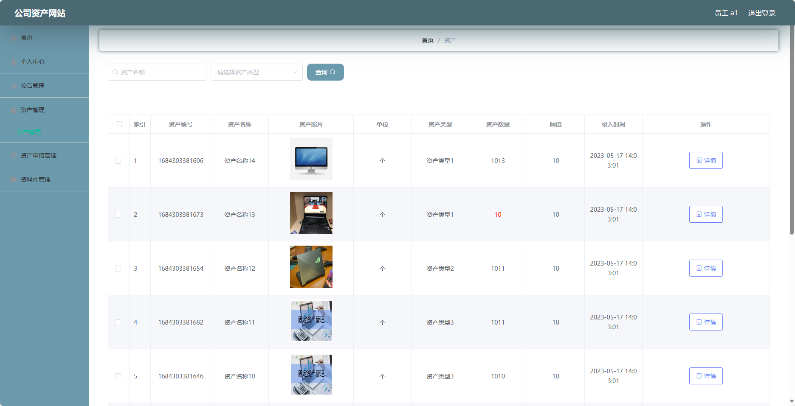
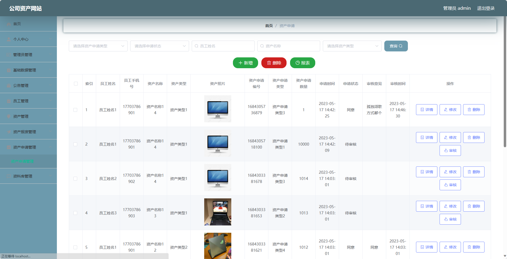
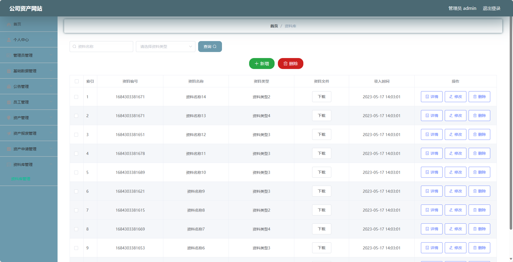

## 基于SpringBoot的公司资产网站(程序+报告)

###  获取sql数据库文件: 从戎源码网 (https://armycodes.com/) QQ: 386869957 QQ群: 377586148
###  所有系统地址: (https://github.com/YuLin-Coder/AllProjectCatalog) 
###  所有项目以及源代码本人均调试运行无问题 可支持远程安装部署调试、定制修改、代码讲解

## 项目介绍
基于SpringBoot的公司资产网站，系统包含两种角色：管理员、员工,主要功能如下。

### 【管理员】:
- 个人中心：管理员可以管理个人信息，包括修改密码等操作。
- 管理员管理：管理员可以管理系统中的管理员账号，包括添加管理员、编辑管理员、删除管理员等操作。
- 基础数据管理：管理员可以管理系统的基础数据，如部门信息、职位信息等。
- 公告管理：管理员可以发布和管理公司的公告信息。
- 员工管理：管理员可以管理系统的员工账号，包括添加员工、编辑员工、删除员工等操作。
- 资产管理：管理员可以管理公司资产信息，包括添加资产、编辑资产、删除资产等操作。
- 资产报废管理：管理员可以管理资产报废流程，包括审核和确认报废申请等操作。
- 资产申请管理：管理员可以管理资产申请流程，包括审批和确认资产申请等操作。
- 资料库管理：管理员可以上传和管理公司的资产资料，包括添加、编辑和删除资料等操作。

### 【员工】:
- 个人中心：员工可以管理个人信息，包括修改密码等操作。
- 公告管理：员工可以查看公司发布的公告信息。
- 资产管理：员工可以查看个人持有的资产信息，包括资产编号、名称、规格等。
- 资产申请管理：员工可以提交资产申请，包括申请新

## 项目技术
- 编程语言：Java
- 数据库：MySQL
- 项目管理工具：Maven
- 前端技术：HTML、CSS、JavaScript、Jquery、Vue
- 后端技术：Spring、SpringMVC、MyBatis

## 运行环境
- JDK版本：JDK1.8及以上
- 开发工具：IDEA、Ecplise、Myecplise都可以
- 数据库: MySQL5.7及以上
- Maven：maven3.0及以上
- Node：14.14.0及以上

## 运行截图

